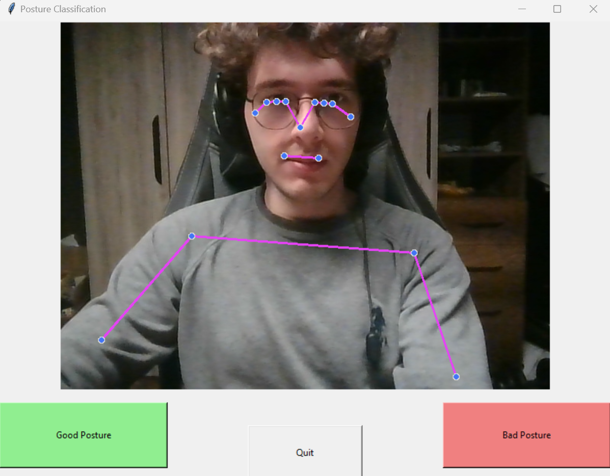
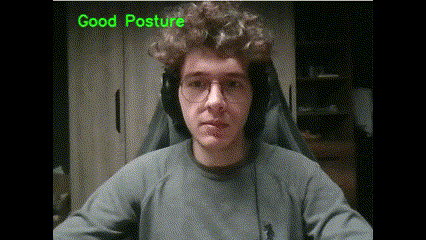

# Posture Classification System

This project implements a posture classification system that detects a person's posture through a webcam feed and classifies it as either "good" or "bad" based on the positioning of various body parts. The system uses MediaPipe for real-time pose detection and a RandomForestClassifier for posture classification. It also includes a GUI for data collection and a training script for the machine learning model.

You can use it to monitor your posture while working at a desk, exercising, or performing any other activity where maintaining good posture is important.

If you want to train the model on your own data, you can use the GUI to tag and save instances of good and bad postures. Then, you can train the model using the collected data.

<p align="center">
  
  
</p>


## Installation

First, ensure you have Python installed on your system. Then, clone this repository and navigate to the project directory. Install the required dependencies with:

```
pip install -r requirements.txt
```

The `requirements.txt` file should contain:
```
opencv-python
mediapipe
numpy
pandas
joblib
scikit-learn
Pillow
```

## Usage

The project is divided into three main components:

### Posture Classifier

This component processes the video stream from the webcam, detects the pose using MediaPipe, and classifies the posture as "good" or "bad" using a trained model.

Run the classifier with:
```
python app.py
```

### Posture Detector with GUI

This GUI application allows users to tag and save instances of good and bad postures to collect data for training.

Run the GUI with:
```
python prepare_train_data.py
```

### Posture Model Training

This script trains a RandomForestClassifier on the collected posture data. It evaluates the model's performance and saves it for later use.

Run the training script with:
```
python train.py
```

## Contributing

Contributions to this project are welcome! Please fork the repository, make your changes, and submit a pull request.

## License

This project is licensed under the MIT License - see the LICENSE.md file for details.
